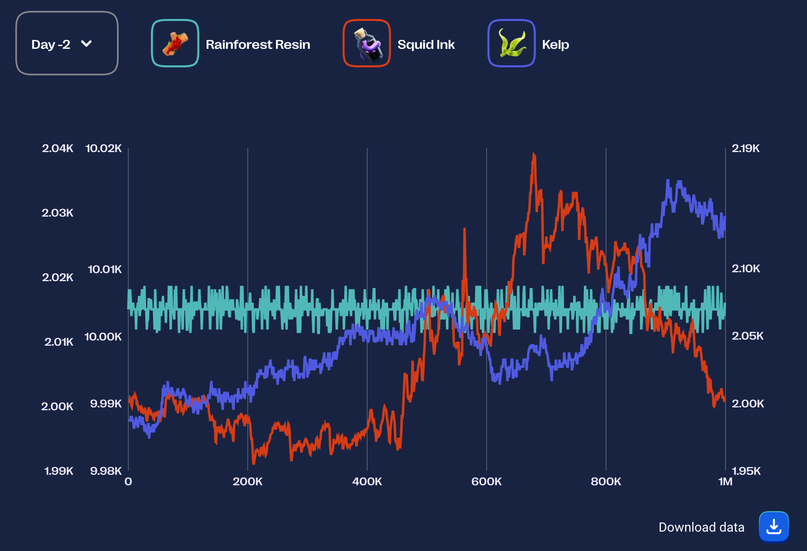
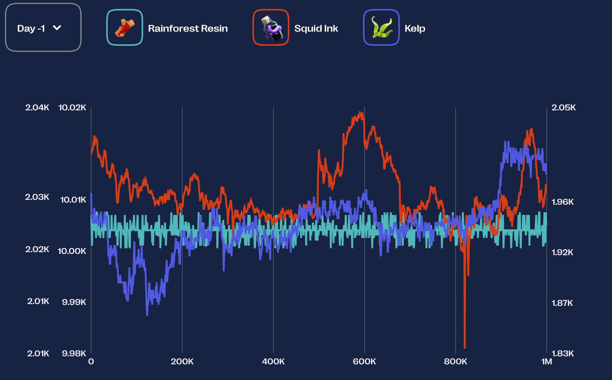
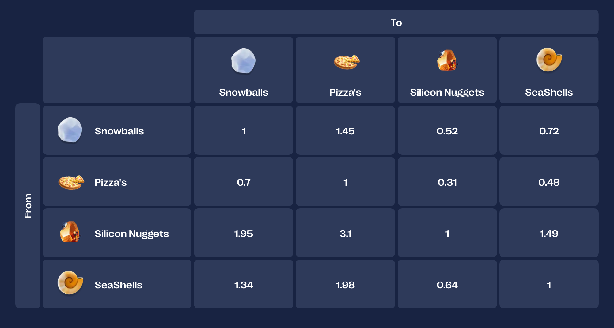

## Algo Trading

In this round we will trade 3 commodities:

1. RAINFORET RAISIN - Steady - valued at 10.000 SeaShells
2. KELP - Harvesting can be tricky and price is unpredictable - valued at 2.000 SeaShells per piece.
3. SQUID INK - There is a pattern to be discovered - valued at 2.000 SeaShells per piece.

## Manual Trading

- Pam the Penguim - trade snowballs
- Devon the Duck - Pineapple Pizza (Hyper inflated currency)
- Benny the Bull - Silicon Nuggets

Trading table
The trading table below shows you the exchange rates from one currency to another. For example: For every Snowball you trade for Pizzas, you will get 1,45 Pizzas in return.

### Solution

The loop S -> P -> B -> N -> S has the highest profit factor (~1.074).
Optimal Trading Strategy Sequence:
Based on the highest profit factor, the optimal sequence is:

Trade SeaShells for Pizza's:
Start: 2,000,000 SeaShells
Convert: 2,000,000 _ 1.98 = 3,960,000 Pizza's
Trade Pizza's for Snowballs:
Convert: 3,960,000 _ 0.70 = 2,772,000 Snowballs
Trade Snowballs for Silicon Nuggets:
Convert: 2,772,000 _ 0.52 = 1,441,440 Silicon Nuggets
Trade Silicon Nuggets for SeaShells:
Convert: 1,441,440 _ 1.49 = 2,147,745.6 SeaShells
Conclusion:

The optimal trading sequence to maximize your SeaShells is:
SeaShells -> Pizza's -> Snowballs -> Silicon Nuggets -> SeaShells

Starting with 2,000,000 SeaShells, this strategy would yield approximately 2,147,746 SeaShells (rounding up), resulting in a profit of about 147,746 SeaShells.

The trading strategy shown in your uploaded image exactly matches this optimal sequence. Therefore, the strategy you have input in the interface is the most profitable one based on the provided exchange rates.

Sources and related content
