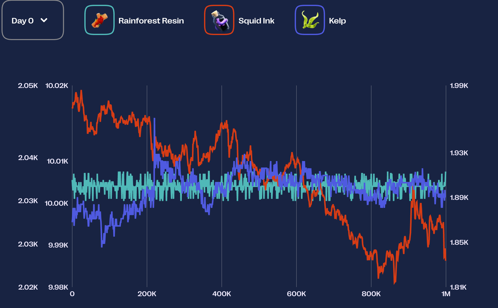
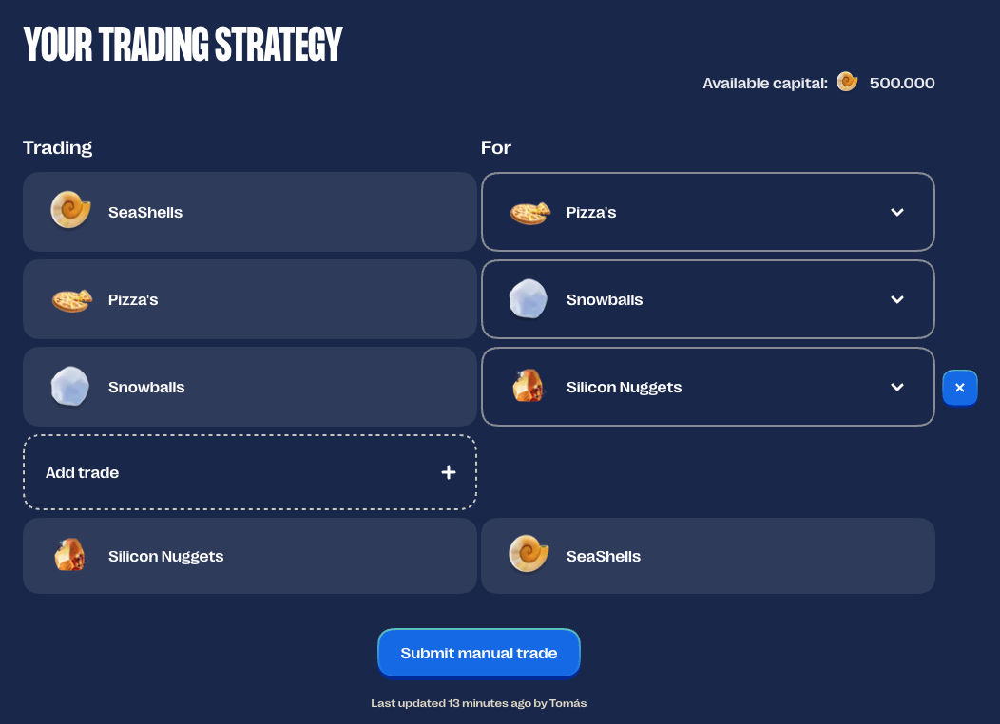

## Algorithm challenge

In this round we will trade 3 commodities:

1. RAINFORET RAISIN - Steady - valued at 10.000 SeaShells
2. KELP - Harvesting can be tricky and price is unpredictable - valued at 2.000 SeaShells per piece.
3. SQUID INK - There is a pattern to be discovered - valued at 2.000 SeaShells per piece.

The first three tradable products are introduced: : `Rainforest Resin` , `Kelp`, and `Squid Ink`. The value of the `Rainforest Resin` has been stable throughout the history of the archipelago, the value of `Kelp` has been going up and down over time, and the value of `Squid Ink` can also swing a bit, but some say there is a pattern to be discovered in its prize progression. All algorithms uploaded in the tutorial round will be processed and generate results instantly, so you can experiment with different programs and strategies.

Position limits for the newly introduced products:

- `RAINFOREST_RESIN`: 50
- `KELP`: 50
- `SQUID_INK`: 50

### Hint

Squid Ink can be a very volatile product with price having large swings. Making a two-sided market or carrying position can be risky for such an instrument. However, with large swings comes large reversion. Squid Ink prices show more tendency to revert short term swings in price.

A metric to keep track of the size of deviation/swing from recent average could help in trading profitable positions.

## Manual challenge

You get the chance to do a series of trades in some foreign island currencies. The first trade is a conversion of your SeaShells into a foreign currency, the last trade is a conversion from a foreign currency into SeaShells. Everything in between is up to you. Give some thought to what series of trades you would like to do, as there might be an opportunity to walk away with more shells than you arrived with.

|  |  |

- Pam the Penguim - trade snowballs
- Devon the Duck - Pineapple Pizza (Hyper inflated currency)
- Benny the Bull - Silicon Nuggets

Trading table
The trading table below shows you the exchange rates from one currency to another. For example: For every Snowball you trade for Pizzas, you will get 1,45 Pizzas in return.

### Solution

The loop S -> P -> B -> N -> S has the highest profit factor (~1.074).
Optimal Trading Strategy Sequence:
Based on the highest profit factor, the optimal sequence is:

Trade SeaShells for Pizza's:
Start: 2,000,000 SeaShells
Convert: 2,000,000 _ 1.98 = 3,960,000 Pizza's
Trade Pizza's for Snowballs:
Convert: 3,960,000 _ 0.70 = 2,772,000 Snowballs
Trade Snowballs for Silicon Nuggets:
Convert: 2,772,000 _ 0.52 = 1,441,440 Silicon Nuggets
Trade Silicon Nuggets for SeaShells:
Convert: 1,441,440 _ 1.49 = 2,147,745.6 SeaShells
Conclusion:

The optimal trading sequence to maximize your SeaShells is:
SeaShells -> Pizza's -> Snowballs -> Silicon Nuggets -> SeaShells

Starting with 2,000,000 SeaShells, this strategy would yield approximately 2,147,746 SeaShells (rounding up), resulting in a profit of about 147,746 SeaShells.

The trading strategy shown in your uploaded image exactly matches this optimal sequence. Therefore, the strategy you have input in the interface is the most profitable one based on the provided exchange rates.

Sources and related content

